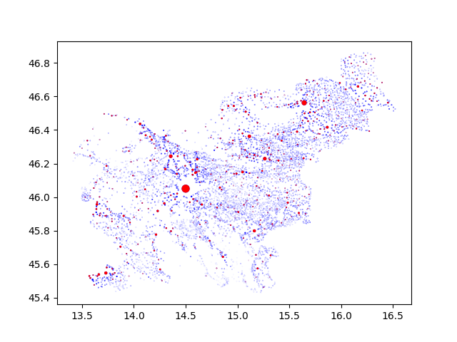

# Slovenia---Settlements-Post-Offices
Database of all Slovenian settlements (villages, towns, cities, ...) and post offices.

## Example
Figure containing all Slovenian settlements. If a settlements contains a post office, it is colored red, else it is blue. Node sizes correspond to the population of the settlement.

## Requirements
Different scripts require different libraries:
- `matplotlibs`,
- `pickle`,
- `wikipedia`.

## JSON
Folder [json](json) contains different JSON representations of the data:
- [naselja.json](json/naselja.json) uses `šumniki`, i.e. `č`, `š` and `ž`, while [naselja_ascii.json](json/naselja_ascii.json) replaces them with `c`, `s` and `z`;
- [naselja_compact.json](json/naselja_compact.json) and [naselja_ascii_compact.json](json/naselja_ascii_compact.json) are compact representations of the above JSON files.

JSON data is represented as a list of dicts, each representing a settlement and containing the following data:
- `town`: town name,
- `title`: Wikipedia title,
- `municipality`: municipality name,
- `municipalityTitle`: municipality Wikipedia title,
- `statRegion`: statistical region,
- `region`: traditional region,
- `population`: population count,
- `latitude`: latitude in degrees,
- `longitude`: longitude in degrees,
- `postNumber`: post number if it contains a post office, else `null`.

## Pickle
Folder [pickle](pickle) contains files saved using `pickle` library. Data saved used classes defined in [datastructure.py](python/datastructure.py).

File [naselja.pkl.gz](pickle/naselja.pkl.gz) contains a list of `Entry`'s, each one representing a settlement. Similarly, [poste.pkl.gz](pickle/poste.pkl.gz) contains a list of `Entry`'s, each representing a town with a post office. Post number is saved in `Entry.idx`. File [naselja_poste.pkl.gz](pickle/naselja_poste.pkl.gz) is [naselja.pkl.gz](pickle/naselja.pkl.gz) with `Entry.idx` set to `None` if the town does not have a post office, else it is set to the post number.

## Data
Data was scrapped from [wiki: Seznam naselij v Sloveniji](https://sl.wikipedia.org/wiki/Seznam_naselij_v_Sloveniji) and [wiki: Seznam poštnih številk v Sloveniji](https://sl.wikipedia.org/wiki/Seznam_po%C5%A1tnih_%C5%A1tevilk_v_Sloveniji) on `20.08.2021`.

This was done using [get_wiki.py](python/get_wiki.py) and [get_post.py](python/get_post.py). Other `Python` files were used to merge data etc.

There may be errors in data, a lof it had to be updated manually.

The following post offices were merged because of various reasons (mostly not being able to get sufficient data for areas in which they are placed):
- Bežigrad, 1113,
- Brnik aerodrom, 4210,
- Ilirska Bistrica - Trnovo, 6251,
- Ljubljana p.p., 1001,
- Ljubljana - Brod, 1133,
- Ljubljana - Črnuče, 1231,
- Ljubljana - Dobrunje, 1261,
- Ljubljana - Dravlje, 1117,
- Ljubljana - Koseze, 1118,
- Ljubljana - Nove Jarše, 1122,
- Ljubljana - Polje, 1260,
- Ljubljana - Šentvid, 1210,
- Ljubljana - Šiška, 1107,
- Ljubljana - Šmartno, 1211,
- Ptuj - Breg, 2251,
- Mostec, 8257.
